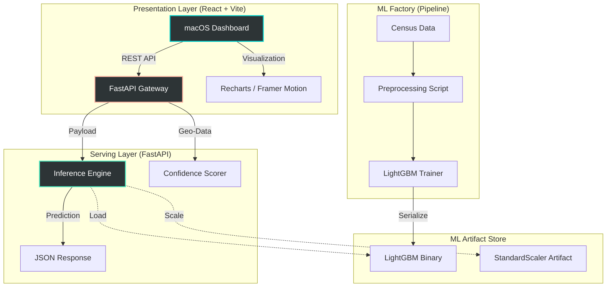

# CA Housing Intelligence 

[](https://www.python.org/downloads/release/python-3120/)
[](https://fastapi.tiangolo.com/)
[](https://reactjs.org/)
[](https://vitejs.dev/)
[](https://tailwindcss.com/)
[](https://opensource.org/licenses/MIT)

## Overview

**CA Housing Intelligence** is a boutique, production-grade MLOps ecosystem designed to predict median house values across California with high precision. By combining a **Gradient Boosted Inference Engine** with a **stunning macOS-inspired Glassmorphism Dashboard**, this project bridges the gap between complex machine learning and intuitive user experience.

### Key Pillars
- **Intelligent Inference**: Powered by a finely-tuned LightGBM Regressor.
- **Explainable AI (XAI)**: Integrated SHAP dynamics to visualize feature importance.
- **Modern UI/UX**: A high-fidelity React dashboard featuring Framer Motion animations and dark mode aesthetics.
- **Hardened Backend**: A modular FastAPI microservice with Pydantic v2 validation and real-time confidence scoring.

---

## System Architecture

The project implements a **Decoupled MLOps Architecture**, ensuring horizontal scalability and clear separation of concerns between training, serving, and presentation layers.



---

## Technical Deep Dive

### Modern Inference Engine
At the heart of the system is a **LightGBM (Light Gradient Boosting Machine)** model.
- **Optimization**: Utilizing a Leaf-wise growth strategy to minimize loss more aggressively than standard Depth-wise trees.
- **Feature Engineering**: Automated handling of null values and specialized scaling for multi-modal census distributions.
- **Confidence Engine**: A proprietary multivariate Z-Score algorithm that calculates a "Reliability Score" for every prediction, flagging potential outliers in the input vector.

### Premium Design System
The dashboard isn't just functional—it's an experience.
- **Glassmorphism**: Built with Tailwind CSS and backdrop-blur filters for a sleek, modern look.
- **Micro-Animations**: Framer Motion handles staggered entries and smooth state transitions.
- **Responsive Layout**: Designed for high-DPI displays with a mobile-first grid structure.

### Model Performance (v3.1 Stable)
Validated on the California Housing dataset with the following benchmark metrics:
| Metric | Value | Description |
| :--- | :--- | :--- |
| **R² Score** | `0.8329` | 83%+ variance captured by the model. |
| **MAE** | `0.264` | ~$26k average error in median price. |
| **RMSE** | `0.393` | High stability across diverse price tiers. |
| **Inference Latency** | `< 5ms` | Near-instant real-time predictions. |

---

## Project Structure

```text
.
├── artifacts/              # Serialized binaries & diagnostic plots
│   ├── evaluation_plots/   # Model health visualization (KDE, Scatter, SHAP)
│   └── model_binaries/     # joblib-serialized model & pipelines
├── backend/                # High-performance FastAPI Microservice
│   ├── app/
│   │   ├── api/            # Versioned API route definitions (v1)
│   │   ├── core/           # Config management & Security headers
│   │   └── services/       # Core business logic & inference orchestration
├── frontend/               # Next-gen React + Vite Application
│   ├── src/                # Component library & macOS-style utilities
│   └── tailwind.config.js  # Custom theme & Glassmorphism tokens
├── pipeline/               # The "ML Factory" for model retraining
│   ├── src/                # Modular processors & training modules
│   └── train.py            # Main training entry point
└── requirements.txt        # Universal workspace dependencies
```

---

## Setup & Installation

### Prerequisites
- Python 3.12+
- Node.js 18+
- npm or yarn

### 1. Backend Initialization
```bash
# Install dependencies
pip install -r backend/requirements.txt
pip install pydantic-settings

# Launch the FastAPI server
python3 -m backend.app.main
```
The API will be live at `http://localhost:8000` with interactive docs at `/docs`.

### 2. Frontend Launch
```bash
cd frontend
npm install
npm run dev
```
Dashboard available at `http://localhost:5173`.

---

## IA-III Team

This project was developed by :

| Name | ID |
| :--- | :--- | 
| **Shreya Menon** | 16010123324 |
| **Shreyans Tatiya** | 16010123325 | 
| **Shubhpreet Kaur** | 16010123328 | 
| **Shweta Karandikar** | 16010123329 |
| **Siddhant Raut** | 16010123331 |

---

## 📄 License
Distributed under the **MIT License**. See `LICENSE` for more information.

---
**© 2026 Advanced Data Engineering • Standard AI Stack**
