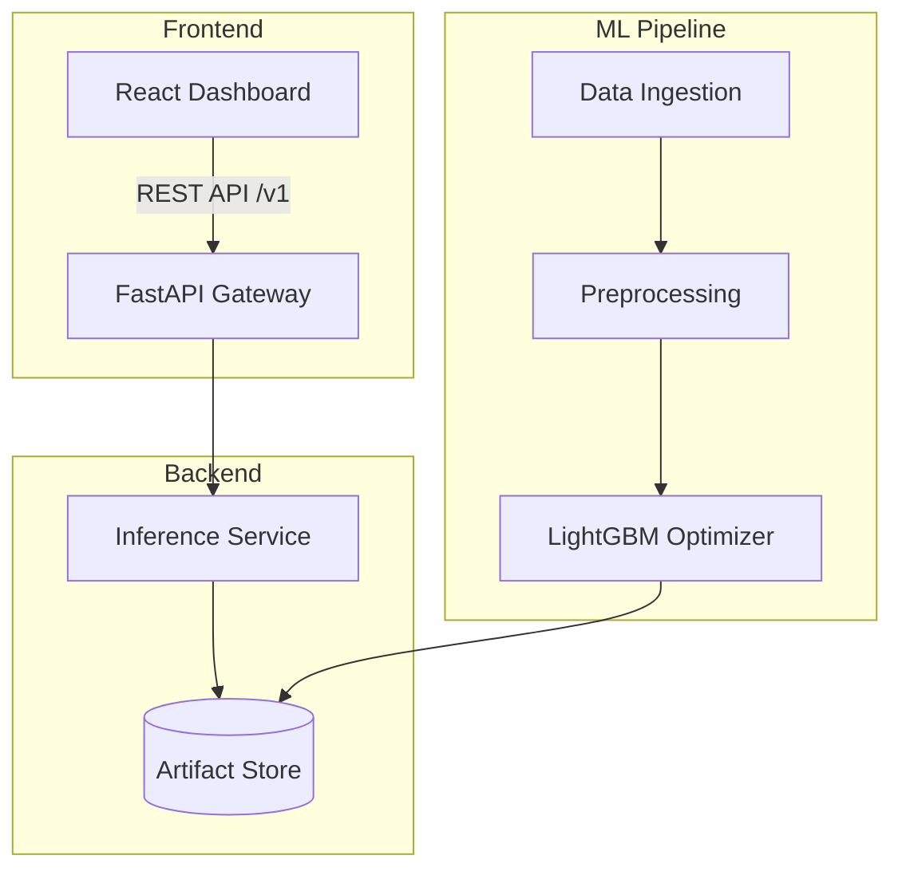

# 🏠 CA Housing Intelligence v2.5

[](https://www.python.org/downloads/release/python-3120/)
[](https://fastapi.tiangolo.com/)
[](https://reactjs.org/)
[](https://opensource.org/licenses/MIT)

A boutique, production-grade Machine Learning system for predicting California housing prices. This project features a **LightGBM-powered inference engine**, a **modular MLOps architecture**, and a **stunning macOS-inspired glassmorphism dashboard**.

---

## 🏛️ System Architecture



---

## ✨ Key Features

- **🚀 Performance-First Inference**: Tuned LightGBM Regressor achieving an $R^2$ of **0.832**.
- **💎 Apple-Standard Design**: Immersive glassmorphism UI with animated background blobs and noise texture overlays.
- **🛡️ Geo-Validation**: Strict Pydantic-level validation for California's geographical bounding box.
- **📈 Data Visualization**: Real-time SHAP-based feature influence and regression precision charts.
- **🏗️ MLOps Architecture**: Completely decoupled training (Pipeline) and serving (Backend) layers.

---

## 📂 Repository Structure

```text
.
├── artifacts/              # Serialized models & evaluation plots
├── backend/                # FastAPI Microservice (v1 API)
├── frontend/               # React + Tailwind + Framer Motion
├── pipeline/               # ML Factory (Training & hyperparameter tuning)
├── notebooks/              # Research, EDA & Experiments
└── requirements.txt        # System-wide dependencies
```

---

## 🚀 Getting Started

### 1. Prerequisites
- Python 3.12+
- Node.js 18+

### 2. Backend Setup
```bash
# Install dependencies
pip install -r backend/requirements.txt
pip install pydantic-settings

# Start the API (v1)
python3 -m backend.app.main
```

### 3. Frontend Setup
```bash
cd frontend
npm install
npm run dev
```

### 4. Retraining the Model
```bash
python3 -m pipeline.train
```

---

## 📊 Model Performance

| Metric | Score |
| :--- | :--- |
| **R² Score** | 0.8329 |
| **RMSE** | 0.3931 |
| **MAE** | 0.2643 |

---

## 🎨 Professional Preview

*Imagine a screenshot here showing the blurred glass panels, glowing price valuation, and animated gradient background.*

---

## 👥 Contributors
**AI IA - II**
- **Shreya Menon** (16010123324)
- **Shreyans Tatiya** (16010123325)
- **Shubhpreet Kaur** (16010123328)
- **Shweta Karandikar** (16010123329)
- **Siddhant Raut** (16010123331)

---

## 📄 License
This project is licensed under the MIT License - see the [LICENSE](LICENSE) file for details.

---

